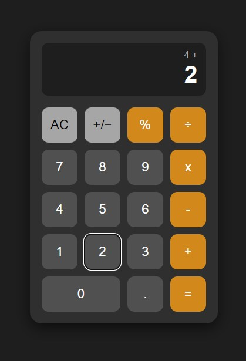

# React Redux Calculator

A basic calculator application built using **React**, **Redux Toolkit**, **Vite**, and tested with **Jest** and **React Testing Library**. The calculator supports basic arithmetic operations, a clear button, and keyboard input handling.

---

## 📦 Tech Stack

- **React** (JSX)
- **Redux Toolkit**
- **React-Redux**
- **Vite** (for fast development & build)
- **Jest** (unit testing)
- **React Testing Library** (component tests)

---

## 🚀 Getting Started

### 1. Clone the repo

```bash
git clone https://github.com/rasika10/redux-calculator.git
cd redux-calculator
```
### Install dependencies

```bash
npm install
```

### Run development server

```bash
npm run dev
```
Open http://localhost:5173 to view the app in your browser.


### Run test suite

```bash
npm run test
```

## Features

- **Arithmetic: +, -, ×, ÷**

- **Keyboard input support**

- **Clear (AC) button**

- **Chained operations**

- **Redux-powered state management**

- **Unit & integration tests**

- **CI/CD-ready**


## Screenshots or GIFs



## 👩‍💻 Author
### Rasika Shirke
#### Frontend Developer & UI/UX Designer
